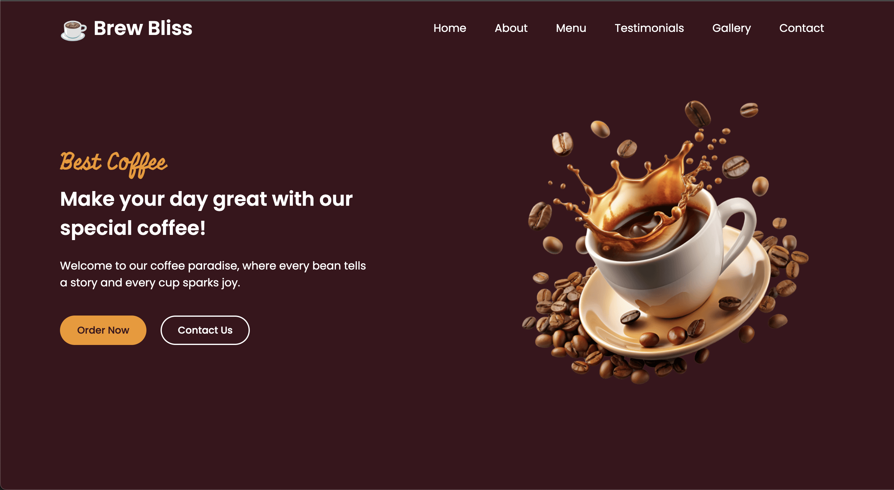

<div align="center">
    <a href="https://github.com/Itssanthoshhere/Brew-Bliss" target="_blank">
      
    </a>
  <br />

  <div>
    
    
    
    
  </div>

  <h3 align="center">☕ Brew Bliss: Premium Coffee Experience</h3>
  <p align="center">A modern and fully responsive <b>coffee shop website</b> built with <b>HTML</b>, <b>CSS</b>, and <b>vanilla JavaScript</b>. It features a clean UI design, interactive menu, customer testimonials, and smooth user experience.</p>

  <a href="https://brew-bliss-five.vercel.app/" target="_blank">
    
  </a>
  <br />
</div>

---

## 📋 Table of Contents

1. 🌟 [Introduction](#introduction)  
2. ⚙️ [Tech Stack](#tech-stack)  
3. 🔥 [Features](#features)  
4. 🚀 [Quick Start](#quick-start)   
5. 🔗 [Links](#links)  
6. 📞 [Contacts](#contacts)  

---

### <a name="introduction">🌟 Introduction</a>

**Brew Bliss** is a stylish and responsive coffee shop website designed to showcase premium coffee experiences and menu offerings. It demonstrates modern UI/UX principles, responsive design with custom CSS, smooth interactions with vanilla JavaScript, and features an intuitive layout for coffee lovers.

Key highlights include:  
- Engaging **Hero section** with coffee promotion  
- Comprehensive **Menu section** with beverage categories  
- Customer **Testimonials slider**  
- Beautiful **Gallery showcase**  
- Interactive **Contact form**  
- Elegant **Footer** with social links  

---

### <a name="tech-stack">⚙️ Tech Stack</a>

- **[HTML5](https://developer.mozilla.org/en-US/docs/Web/HTML)** – Semantic markup structure  
- **[CSS3](https://developer.mozilla.org/en-US/docs/Web/CSS)** – Custom styling and responsive design  
- **JavaScript (ES6)** – Interactive features and mobile menu  
- **[Swiper.js](https://swiperjs.com/)** – Testimonials slider functionality  
- **[Font Awesome](https://fontawesome.com/)** – Icons and visual elements  

---

### <a name="features">🔥 Features</a>

- 🌐 **Fully responsive design** (mobile, tablet, desktop)  
- 🧭 **Interactive Navbar** with mobile hamburger menu  
- 🎨 **Modern UI** with custom CSS styling and smooth animations  
- ⚡ **Hover effects** and transition animations throughout  
- ☕ **Comprehensive Menu** featuring hot beverages, cold drinks, desserts, and combos  
- 📰 **Customer Testimonials** with interactive Swiper slider  
- 🖼️ **Gallery Section** showcasing coffee shop ambiance  
- 📝 **Contact Form** for customer inquiries  
- 📱 **Social Media Integration** with Facebook, Instagram, and Twitter links  
- 🌟 **Privacy & Refund Policies** included  
- 🚀 **Fast loading** and optimized performance  

---

### <a name="quick-start">🚀 Quick Start</a>

#### **Clone the Repository**
```bash
git clone https://github.com/Itssanthoshhere/Brew-Bliss.git
cd Brew-Bliss
```

#### **Open in Browser**

Since this is a **static project**, simply open `index.html` in your browser or use a Live Server extension in VS Code.

---

### <a name="links">🔗 Links</a>

* **GitHub Repository** → [Brew-Bliss](https://github.com/Itssanthoshhere/Brew-Bliss)
* **Live Demo** → [https://brew-bliss-five.vercel.app/](https://brew-bliss-five.vercel.app/)

---

### <a name="contacts">📞 Contacts</a>

👤 **Santhosh VS**

* GitHub: [Itssanthoshhere](https://github.com/Itssanthoshhere)
* LinkedIn: [Santhosh VS](https://www.linkedin.com/in/thesanthoshvs/)

---

#### ⭐ Show Your Support

If you liked this project, **give it a ⭐** and share it with others!

---